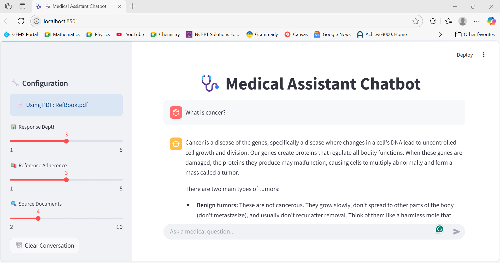
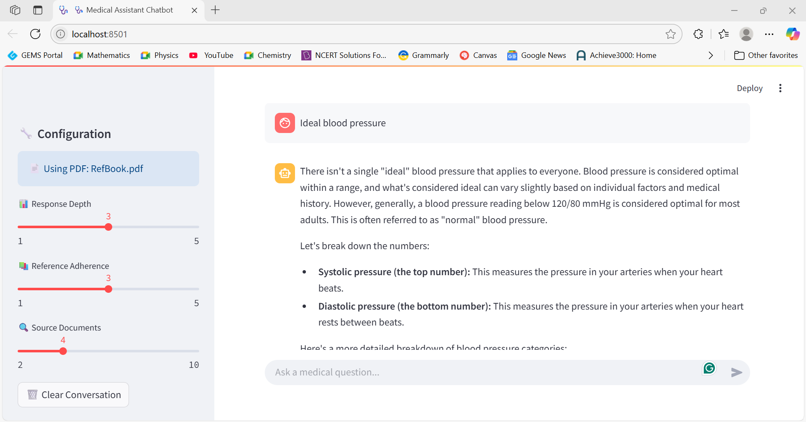

# Medical Chatbot with Streamlit & LangChain

An AI-powered medical chatbot built with Streamlit, LangChain, and Google Gemini to answer medical questions using PDF documents.

---

## 🚀 Features

- Chatbot interface powered by LangChain and Google Gemini
- PDF document processing for accurate medical information retrieval
- Vector search with FAISS for efficient knowledge querying
- Easy deployment on Streamlit Cloud

---

## 📋 Prerequisites

- Python 3.8 or higher
- Git installed on your system
- GitHub account
- Streamlit account (optional, for hosting)

---

## 📸 Screenshots

Here is how the chatbot looks when running:

Example response from the bot:

## 📽 Demo Video

Click the image below to watch a demo of the Medical Chatbot in action:

